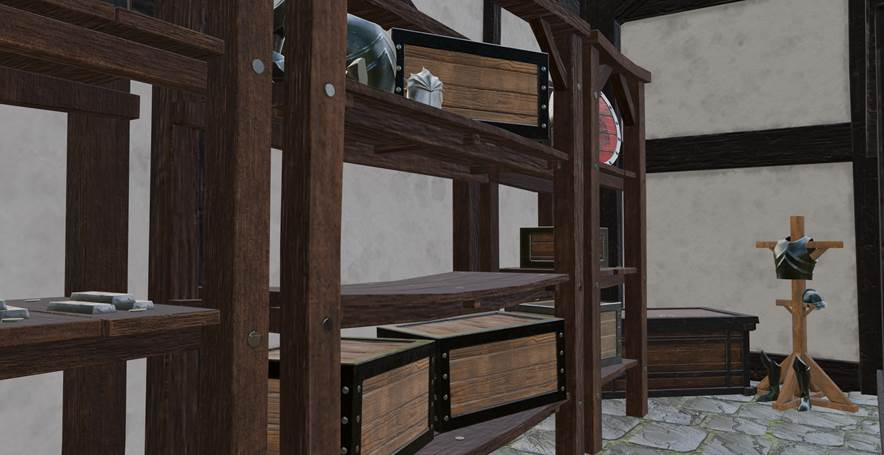
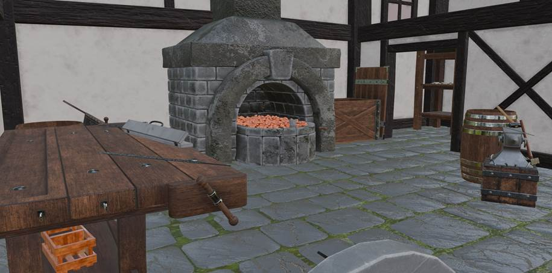
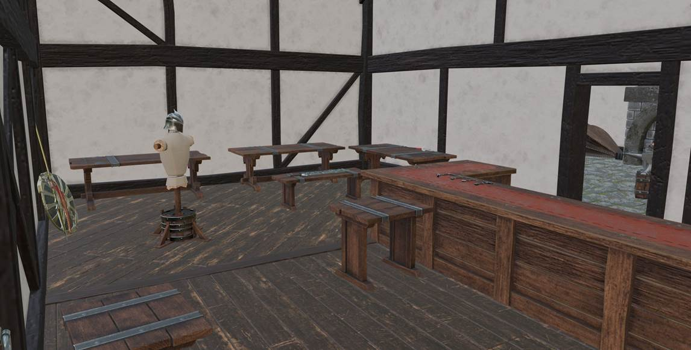

# «Blacksmith VR»

Симулятор средневековой кузницы. Командный проект для VR-устройств Pico 4, разработанный на Unity.

## О проекте

Игра погружает в атмосферу средневековой кузницы, предлагая реалистичный опыт создания меча - от плавки металла до заточки и выбора дизайна.​

## Моя роль

- Проектирование архитектуры

- Реализация VR-взаимодействий (захват, перемещение, использование объектов)

- Разработка механик (сборка оружия, тестирование на манекене, обучение, сдача заказа)

- Реализация системы заказов и логики выполнения задач

- Настройка физики объектов, коллизий и поведения в VR

- Интеграция UI (инструкции, интерфейс)

- Тестирование и доработка

## Технологии

XR Interaction Toolkit

Unity

C#

Visual Studio

Git

UI System

## Видео игрового процесса

[Ссылка на видео](https://drive.google.com/file/d/1DGK8sU85CYoh58r4dM5So25an5ejjb0y/view?usp=sharing)

## Билд

[Скачать последнюю версию](https://github.com/darsidaff/Blacksmith/releases/tag/V1)

## Скриншоты

 

